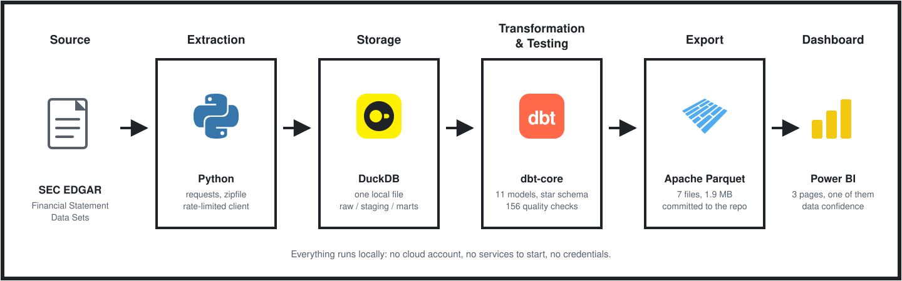
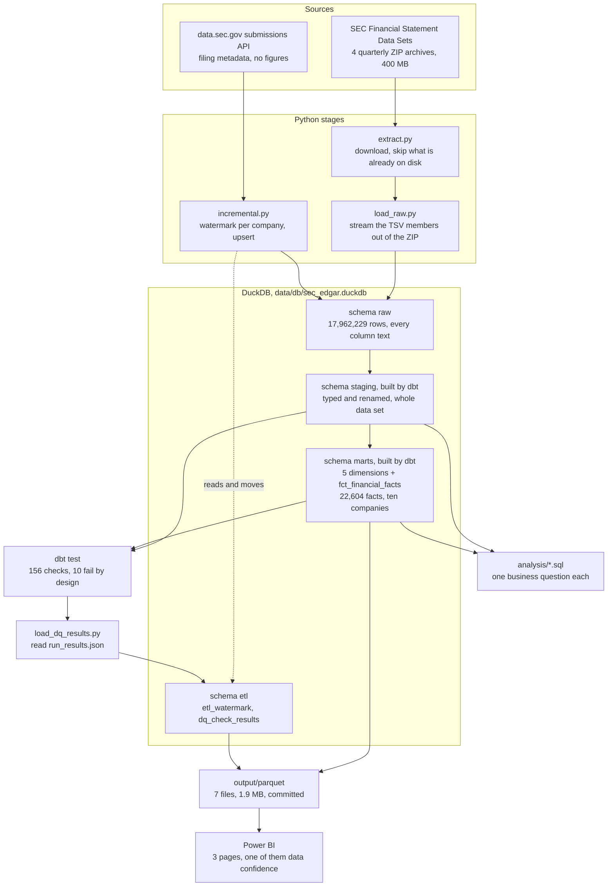
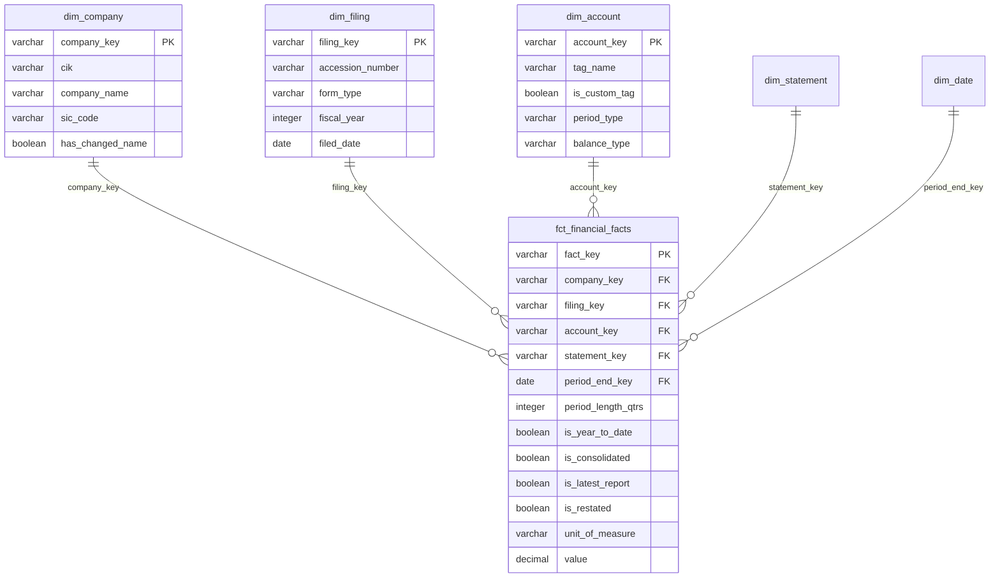
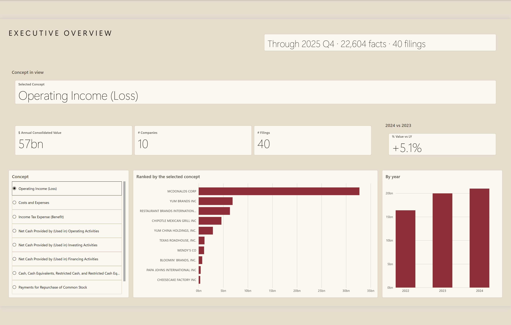
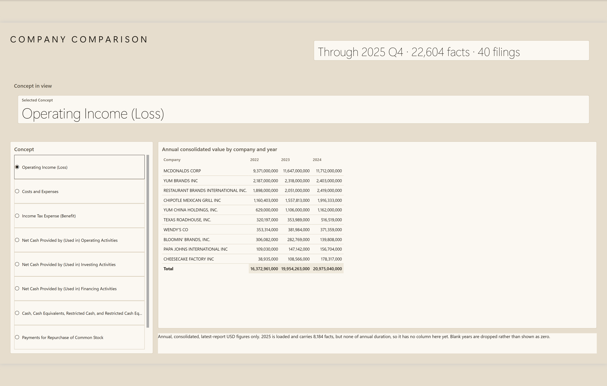
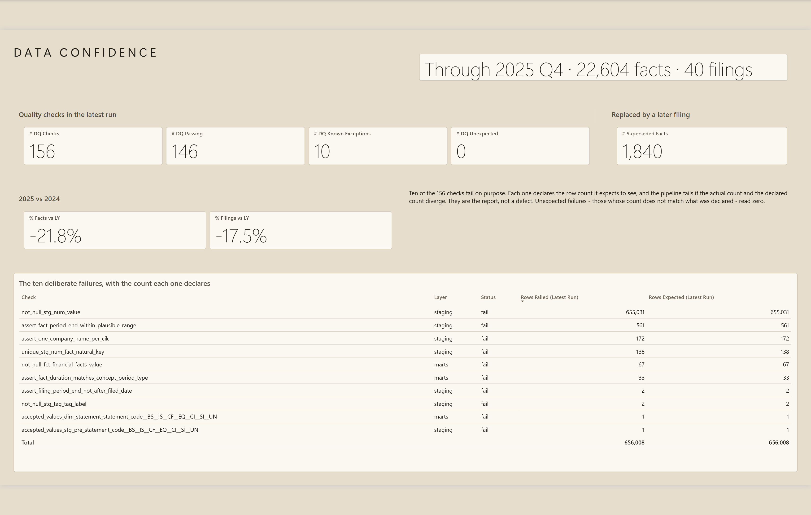

# SEC EDGAR Financial Statements Pipeline

End-to-end data pipeline that turns 18 million rows of raw SEC XBRL filings into a tested star
schema for financial analysis.

**Python** · **DuckDB** · **dbt-core** · **Power BI**

## Objective

The SEC publishes every US public company's financial statements as free quarterly bulk
downloads. The data is complete and authoritative — and it will quietly hand you a wrong number
if you treat it like a normal table.

The goal of this project was to build the full path from those raw archives to a dashboard, with
the hard part being the **data** rather than the infrastructure: a fact table where every
double-counting hazard is an explicit, tested, documented flag, and where every published figure
is checked against a written expectation before it ships.

It runs entirely on a laptop. No cloud account, no services to start, no credentials.

## Table of Content

- [Dataset Used](#dataset-used)
- [Technologies](#technologies)
- [Data Pipeline Architecture](#data-pipeline-architecture)
- [Data Modeling](#data-modeling)
- [Step 1: Extraction](#step-1-extraction)
- [Step 2: Raw Load](#step-2-raw-load)
- [Step 3: Incremental Ingestion](#step-3-incremental-ingestion)
- [Step 4: Transformation](#step-4-transformation)
- [Step 5: Data Quality Testing](#step-5-data-quality-testing)
- [Step 6: Analytics](#step-6-analytics)
- [Step 7: Dashboard](#step-7-dashboard)
- [Key Technical Decisions](#key-technical-decisions)
- [Key Findings](#key-findings)
- [How to Run](#how-to-run)
- [What I Learned](#what-i-learned)
- [What Is Not in This Repository](#what-is-not-in-this-repository)
- [Limitations](#limitations)
- [Documentation](#documentation)

## Dataset Used

**Primary source — SEC EDGAR Financial Statement Data Sets.** Quarterly ZIP archives, 2025 Q1 to
2025 Q4.
[sec.gov/data-research](https://www.sec.gov/data-research/sec-markets-data/financial-statement-data-sets)

| | |
|---|---|
| Raw rows loaded | **17,962,229** |
| Filings | 26,085 from 7,151 companies |
| Accounting concepts | 348,770 |
| Presentation lines | 2,965,835 |
| Reported facts | 14,621,539 |
| Download size | ~400 MB compressed, 2.6 GB unzipped |

Each archive holds four tab-separated files: `sub.txt` (one row per filing), `tag.txt` (the
concept catalogue), `pre.txt` (where each concept appears in the rendered statements) and
`num.txt` (the figures, 3.7 million rows a quarter).

**Secondary source — the `data.sec.gov` submissions API.** The quarterly archives run roughly a
quarter behind, so the pipeline also reads the submissions API for filings the ten scope
companies have made since the bulk load. It publishes filing metadata, not reported figures.

This stage exists to demonstrate the incremental-ingestion pattern — a per-company watermark and
an upsert on the natural key. **It is not a scheduled or continuously running feed:** it is
invoked on demand as part of a pipeline run.

**Analytical scope.** The pipeline loads everything; the analysis covers **ten eating and
drinking places**, each with a December fiscal year end and a complete 2025 filing cycle — from
McDonald's at 25.92 bn USD of FY2024 revenue down to Papa John's at 2.06 bn. Selection criteria,
rejected sectors and the reproducing query are in [`docs/scope.md`](docs/scope.md).

**What makes this data hard is not its volume.** It is that a reasonable-looking `SUM()` over the
fact table is wrong by roughly a factor of two, and **nothing fails while it happens**:

| What is in the data | Why a naive sum breaks |
|---|---|
| Year-to-date rows sit **beside** the quarters they already contain | `period_length_qtrs` has **88** distinct values, not 3 |
| Segment breakdowns repeat the company total | **57.76%** of rows — the majority, not an edge case |
| Figures superseded by a later filing stay in the table | 1,840 of 22,604 facts |
| 134 units of measure coexist in one column | USD, shares and pure ratios, all summable, all meaningless together |
| There is no single tag meaning "revenue" | 4 tags in use; 350 companies use more than one |

Every one of those is exposed as a boolean flag on the fact table, tested, and documented next to
the decision that produced it. No query or measure in this project aggregates without taking an
explicit position on all of them.

The source also contradicts its own documentation in ways worth knowing: the eight-field key the
SEC declares unique for `num.txt` is not unique, `stmt` has an undocumented eighth value, 96% of
the concept catalogue is invented by filers, and 2,045 facts claim to span up to 124 quarters.
Each is measured with its row count in [`docs/data_quality.md`](docs/data_quality.md).

## Technologies

| Layer | Tool | Why |
|---|---|---|
| Extraction | Python (`requests`, `zipfile`) | Flat files, no authentication required |
| Storage | DuckDB, single local file | Small volume, clone and run with no accounts |
| Transformation | dbt-core with `dbt-duckdb` | Analytics engineering standard |
| Data quality | dbt generic + singular tests | Quality is a deliverable, not an appendix |
| Analysis | Plain SQL in `analysis/` | Window functions and CTEs |
| BI | Power BI over exported Parquet | DuckDB has no native Power BI connector |

## Data Pipeline Architecture

Two sources, four layers in one DuckDB file, and a Parquet export because Power BI cannot read
DuckDB.



In more detail, including where the quality suite and the watermark sit:



Three properties of this shape are deliberate. **The layers share one file**, because DuckDB is
a file rather than a server, so nothing has to be started before the pipeline runs. **Staging
covers the whole data set while the marts cover ten companies**, so the quality suite measures
the source rather than a 0.15% slice of it. **Bookkeeping is kept out of the data** in an `etl`
schema, so rebuilding the raw layer does not take the record of what has been read and checked
with it.

## Data Modeling

**Staging** — five models. Four are a typed and renamed projection of the four source files; the
fifth, [`stg_filing_index`](dbt/models/staging/stg_filing_index.sql), types the filing index the
incremental stage lands. Nothing is filtered to the analytical scope here.

| Model | Grain | Rows in | Rows out |
|---|---|---|---|
| [`stg_sub`](dbt/models/staging/stg_sub.sql) | One filing | 26,085 | 26,085 |
| [`stg_tag`](dbt/models/staging/stg_tag.sql) | One accounting concept | 348,770 | 329,861 |
| [`stg_pre`](dbt/models/staging/stg_pre.sql) | One presentation line | 2,965,835 | 2,965,835 |
| [`stg_num`](dbt/models/staging/stg_num.sql) | One reported numeric fact | 14,621,539 | 14,619,494 |

Only two models drop rows and both say so in SQL, with the count. [`stg_tag`](dbt/models/staging/stg_tag.sql) removes 18,909
repeat copies of a concept because the catalogue ships inside every quarterly archive —
deduplication verified lossless by checking that no concept disagrees with itself across
quarters. [`stg_num`](dbt/models/staging/stg_num.sql) removes 2,045 facts whose duration exceeds four quarters, up to 124, which
is filer error rather than a period.

**Marts** — a star schema over the ten scope companies: one fact table and five dimensions,
22,604 facts.



Three source properties forced a modelling decision, each taken explicitly rather than by
omission. **Durations** — half-year and nine-month figures are kept alongside the quarters they
contain, because nine of the ten companies report interim cash flow only as year-to-date; the
hazard is exposed through `is_year_to_date` rather than filtered away. **Segment breakdowns** —
kept in full with `is_consolidated`, because filtering them out would remove 8,445,022 facts and
the entire statement of stockholders' equity. **Duplicates on the natural key** — both rows kept
and flagged; the `unique` test fails on 138 keys, and that failure is the finding.

Full reasoning, with the alternatives that lost, in
[`docs/modeling_decisions.md`](docs/modeling_decisions.md).

## Step 1: Extraction

[`src/extract.py`](src/extract.py) downloads the four quarterly ZIP archives from the SEC.

Idempotent by design: an archive already on disk is not fetched again. Access rules live in one
place, [`src/sec_client.py`](src/sec_client.py) — a process-wide rate limiter holding to the SEC's 10 requests per
second, and the retry policy for transient failures. The SEC rejects any automated request that
does not identify its caller by name and email in a `User-Agent` header, so that value is read
from `.env` and the run fails immediately with an explanation if it is missing, rather than
returning a confusing 403 partway through.

## Step 2: Raw Load

[`src/load_raw.py`](src/load_raw.py) streams the tab-separated members **straight out of the ZIP** into the DuckDB
`raw` schema — every column as text, no typing yet.

Streaming rather than extracting matters here: unzipped, the archives come to 2.6 GB. Members
are loaded smallest first, so a malformed archive fails on a two-megabyte file rather than half
a gigabyte into the load. Idempotent by source file.

Typing is deliberately deferred to staging. A raw layer that mirrors the source exactly is what
lets the quality suite measure the source rather than measure the loader.

A read-only companion, [`src/profile_raw.py`](src/profile_raw.py), prints the evidence behind
every figure quoted in [`docs/data_quality.md`](docs/data_quality.md). The numbers in that
document are reproducible rather than recorded from a note.

## Step 3: Incremental Ingestion

[`src/incremental.py`](src/incremental.py) asks the SEC submissions API what the ten scope companies have filed since
the bulk load, writes the filing index, and moves a per-company watermark.

The subtlety is a timezone. The submissions API dates acceptance in UTC to the second, while
`sub.txt` records the same event in US Eastern rounded to the nearest minute. Rounding can push
the recorded value up to 30 seconds past the true one, so a watermark seeded from `sub.txt` is
pulled back by a safety margin. The boundary then always **re-reads** a filing rather than
risking a skip — and re-reading costs nothing, because the write is an upsert on the natural key.

## Step 4: Transformation

`dbt seed` loads the scope roster; `dbt run` builds the staging layer and then the star schema.

The roster lives in a dbt seed rather than in Python, and [`src/config.py`](src/config.py) reads it from there.
dbt cannot read Python, so the alternative was the same list maintained twice in two languages
with nothing keeping them in step — and a roster that disagrees with itself does not fail
loudly. It just quietly analyses a different set of companies than the extractor refreshes.

**`dbt build` is deliberately never used.** It interleaves models and tests and skips anything
downstream of a failing test. That is the right default and the wrong one here: ten of these
tests are expected to fail, so `build` never reaches the marts. Splitting `run` from `test`
keeps every test at error severity instead of softening ten of them to let a build through.

## Step 5: Data Quality Testing

**156 checks. 146 pass. 10 fail on purpose.**

The ten failures are documented properties of the source, not defects in the pipeline. Each one
declares its expected row count in `meta.expected_failures`, and [`src/load_dq_results.py`](src/load_dq_results.py)
compares declared against actual and **fails if they diverge**. A check that starts passing is
as much a signal as one that starts failing.

Results are appended to `etl.dq_check_results`, read out of dbt's own `run_results.json` and
never typed in by hand, so quality has a history rather than only a latest run. That table is
what the third dashboard page reads.

`dbt test` exits non-zero by design. **That is the report, not a failure.**

## Step 6: Analytics

Five standalone SQL queries in [`analysis/`](analysis/), one per business question, each opening
with the flags it uses and why. A sixth, [`00_scope_selection.sql`](analysis/00_scope_selection.sql), reproduces the choice of the
ten companies rather than answering a question about them.

1. How did revenue and net income evolve per company, quarter over quarter?
2. Which companies improved operating margin year over year, and which eroded it?
3. How did leverage evolve by sector?
4. What share of reported concepts are custom tags rather than standard US-GAAP, and what does
   that cost comparability?
5. How many facts were restated, and which companies concentrate those corrections?

Questions 4 and 5 run against **staging**, over all 26,085 filings, because they are questions
about the source rather than about the ten companies.

## Step 7: Dashboard

[`src/export_marts.py`](src/export_marts.py) copies the marts and the quality history to [`output/parquet/`](output/parquet), verifying
every file against GitHub's 100 MiB limit before it can become a rejected push. Power BI reads
that folder. Three pages over the exported star schema:



*Executive Overview — one accounting concept at a time across the ten companies, with the
year-on-year move.*

<table>
<tr>
<td width="50%"></td>
<td width="50%"></td>
</tr>
<tr>
<td><em>Company Comparison — the ten against each other by year, with the sector total.</em></td>
<td><em>Data Confidence — what each of the 156 quality checks returned, against what it declared.</em></td>
</tr>
</table>

Two decisions here are engineering rather than design.

**Every figure is verified before it ships.** The expected value of each number on these pages is
written down *before* the query runs, in
[`powerbi/verification-gates.sql`](powerbi/verification-gates.sql). If a result disagrees with the
expectation, the report is wrong — the expectation does not get adjusted to fit. The gates also
assert the grain is one fact per company per year per concept, which is what stops a chart
silently double counting.

**The concept slicer forces exactly one selection, and that is a correctness device rather than a
convenience.** The value measure sums whatever concepts are in filter context, so with none
selected it reported 252bn — nine concepts spanning three financial statements added together, a
number that means nothing but looks authoritative. The report leads on a concept rather than on
revenue for the same reason: no single tag means revenue, and within this scope `NetIncomeLoss`
reaches 8 of 10 companies while `Revenues` reaches only 6.

The third page reports on the pipeline's own inputs rather than on the business, reading
[`dq_check_results.parquet`](output/parquet/dq_check_results.parquet) directly. That is the point of exporting the quality history alongside
the marts.

> **The report files themselves are not in this repository.** The semantic model, the generated
> visual JSON and `theme-lab` — a token-based theme compiler with an automated WCAG contrast
> audit that produces the look above — live in a separate repository, since the theme system is a
> general-purpose tool rather than a part of this pipeline.
>
> *Link to follow once that repository is published.*

## Key Technical Decisions

**The industry spans two SIC codes, not one.** 5810 and 5812 name the same business and the
filer chooses which to report, so McDonald's and Chipotle land in one while Starbucks and
Wendy's land in the other. Filtering on either alone drops direct competitors of companies that
stay in. The first version of the scope had Wendy's outside and Burger King inside — a bug that
produced a complete, plausible, wrong answer.

**The scope criterion was wrong, not the company.** Company selection originally required
reporting a `Liabilities` total. McDonald's does not publish one — it gives the balance sheet
total and lets the reader subtract equity — and so dropped out of its own industry's top ten.
The pipeline now derives the figure from the accounting identity and records
`liabilities_source` per row, reading `derived from the balance sheet identity` or `reported`.

**Q4 does not exist and has to be derived.** No company files a standalone Q4; the annual report
covers it. Those rows are computed as full year less Q1–Q3 and carry `is_derived_quarter` plus a
`revenue_tag` reading `derived: full year less Q1 to Q3`. Yum! Brands' derived Q4 2024 revenue
is 29.4% above Q3 — seasonality, not an error, but a chart that did not distinguish derived from
reported would invite the opposite reading.

**Negative equity returns null, not a small number.** Three of the ten have negative book equity
from buybacks. Debt-to-equity with a negative denominator is not a low ratio, it is a meaningless
one, so the query nulls it, flags `has_negative_equity`, and reports liabilities-over-assets
alongside, which stays defined.

## Key Findings

Every figure below comes from a named query in [`analysis/`](analysis/), run against the
warehouse this repository builds.

**Net margin inside one industry runs from 32% to below zero.** In 2025 Q3 McDonald's turned
7,078 m USD of revenue into 2,278 m of net income — a **32.2%** net margin. The same quarter,
Papa John's made **0.9%** on 508 m and Bloomin' Brands lost 46 m on 929 m, **-4.9%**. These are
all restaurant companies.

**Operating margin spreads 41.7 points, and the split is structural.** FY2024 runs from
McDonald's at **45.2%** to Bloomin' Brands at **3.5%**. Every franchise-led company lost ground
or held; every company-operator gained. The franchisor collects royalties without carrying the
cost of running restaurants. The operator carries both.

**96.24% of the accounting vocabulary carries 8.54% of the numbers.** 317,473 of 329,861
concepts are company-invented, and a custom tag is nine times less likely to be shared than a
standard one. The clearest example is a capital letter: `NonCashLeaseExpense` (135 companies)
and `NoncashLeaseExpense` (111) are the same concept split across two strings that nothing in
the source relates to each other.

**One fact in seven is reported more than once, and 1.37% of those change.** Counting
restatements names the wrong companies; the *share* identifies them. Franklin BSP Capital leads
on volume at 408 restated facts — but that is 6.6% of what it repeats. Azenta restated **252 of
402, or 62.7%**.

## How to Run

Requires Python 3.12+. No accounts, no cloud, no services to start.

```bash
git clone https://github.com/rdiguglielmo/sec-edgar-financial-pipeline
cd sec-edgar-financial-pipeline
python -m venv .venv
.venv/Scripts/pip install -r requirements.txt      # Linux/macOS: .venv/bin/pip
cp .env.example .env                               # add your name + email for the SEC User-Agent
```

The SEC rejects automated requests that do not identify the caller, so `.env` is not optional.
It holds contact details, not a credential.

```bash
.venv/Scripts/python src/extract.py                # download 4 quarterly archives (~400 MB)
.venv/Scripts/python src/load_raw.py               # stream TSVs from the ZIPs into DuckDB
.venv/Scripts/python src/incremental.py            # catch up from the submissions API
.venv/Scripts/dbt seed --project-dir dbt --profiles-dir dbt
.venv/Scripts/dbt run  --project-dir dbt --profiles-dir dbt
.venv/Scripts/dbt test --project-dir dbt --profiles-dir dbt   # exits non-zero by design
.venv/Scripts/python src/load_dq_results.py
.venv/Scripts/python src/export_marts.py
```

dbt must run from the repository root. From anywhere else, `dbt-duckdb` silently creates an
empty database at the relative path and everything fails with "source not found".

**To skip the build entirely:** [`output/parquet/`](output/parquet) is committed (1.9 MB), so the exported star
schema is already in the clone. Query it with DuckDB directly, or open it in Power BI.

Ad-hoc queries go through [`src/query.py`](src/query.py), which is read-only and uses only the
`duckdb` package the pipeline already depends on — nothing else to install, no server to start.
Given a `.sql` file it runs each section and prints the written expectation above the result:

```bash
.venv/Scripts/python src/query.py "SELECT * FROM marts.dim_company"
.venv/Scripts/python src/query.py powerbi/verification-gates.sql
```

## What I Learned

**The dangerous bug is the one that returns a number.** Four errors reached work-in-progress on
this project and not one of them crashed anything — the scope criterion that dropped McDonald's,
the industry assumed to be one SIC code, a published table that no recorded query could
reproduce, and a raw loader written with quoting disabled that would have shifted 30 rows one
column over. In every case the program ran fine and printed something believable. All four were
caught by **measuring**, never by re-reading the code.

**So the process became: write the expected number down first.** Every figure the dashboard
shows has its expected value written in `powerbi/verification-gates.sql` *before* the query
runs. If the result disagrees, the report is wrong — the expectation does not get adjusted to
fit. That ordering is the whole trick, and it costs nothing.

**Test the source's documentation, not just your own code.** The eight-field key the SEC
declares unique is not unique. `qtrs` takes 88 values where the docs imply three. `stmt` has an
undocumented eighth value. Each became a test with its row count recorded, which is why they are
facts in this README rather than surprises in a dashboard.

**Design systems beat hand-formatting.** The report theme is compiled from about twenty-five
design tokens rather than set per visual, with an automated WCAG contrast audit in the build.
The first version had cards at 1.10:1 against their background — invisible edges that cost
something and separated nothing. Catching that needed a measurement, not an opinion.

**Silent failure is a UI property too.** Much of Power BI formatting fails without error: clean
validation, no visible effect. A card sized for a smaller callout clipped its own descenders and
shipped `40 filinqs` across all three pages. It survived review because it reads as a font
quirk. Reading the *words* in a screenshot, not just the layout, is now part of the checklist.

## What Is Not in This Repository

This repository is the **data engineering** half, and it is complete: everything needed to
extract, load, model, test and export the warehouse is here and runnable.

The report-authoring half lives separately, because it is a different discipline and a
general-purpose tool rather than a part of this pipeline:

- **The PBIP project** — the semantic model and generated visual JSON. Roughly forty
  machine-written files that are not meaningful to read as source. What they produce is in
  [Step 7](#step-7-dashboard), and `powerbi/verification-gates.sql` shows how every figure on
  them was checked.
- **`theme-lab`** — a theme compiler that builds a full Power BI theme from about twenty-five
  design tokens, with an automated WCAG contrast audit and a live preview harness in the build.

*Link to follow once that repository is published.*

## Limitations

- **Operating margin, not gross margin.** Forced by the source: the cost-of-sales tag is
  reported by fewer than half of all filers.
- **Annual figures exist for 2022–2024 only.** 2025 is loaded and has facts, but no
  annual-duration ones yet, so any year-over-year comparison covers three years.
- **Ten companies, one industry.** Enough to make margins comparable, not enough to generalise.
  The two questions that need breadth are answered against all 26,085 filings instead.
- **Two restatements found inside the scope are an anecdote.** Which is precisely why the
  restatement question is answered against the whole source.

## Documentation

| Document | What is in it |
|---|---|
| [`docs/engineering-notes.md`](docs/engineering-notes.md) | The rules that produce a wrong number without anything failing. Read first. |
| [`docs/scope.md`](docs/scope.md) | How the ten companies were selected, and what was rejected |
| [`docs/data_dictionary.md`](docs/data_dictionary.md) | Every column, including the mapping from the SEC's own names |
| [`docs/data_quality.md`](docs/data_quality.md) | Each source defect, measured, with its row count |
| [`docs/modeling_decisions.md`](docs/modeling_decisions.md) | Each modelling fork, with the alternatives that lost |

---

Part of a four-project data portfolio: [github.com/rdiguglielmo](https://github.com/rdiguglielmo)

Licensed under the [MIT License](LICENSE). SEC filing data is public domain.
